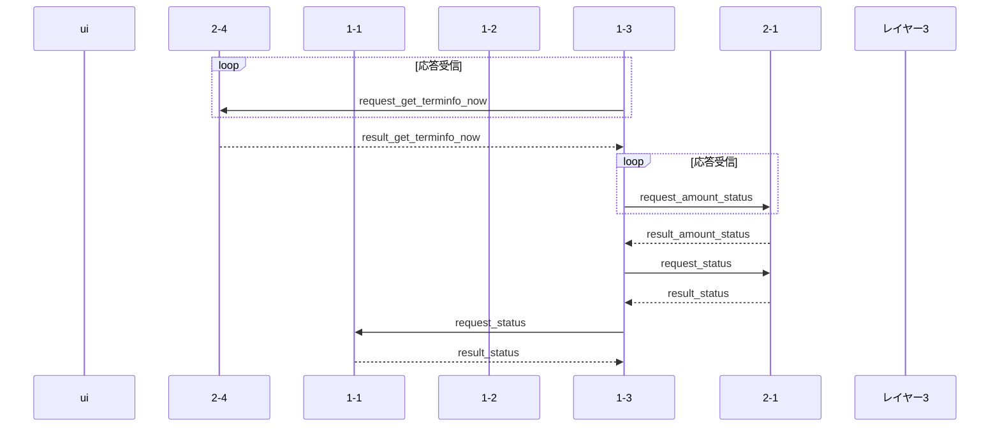

# FIT-A
更新日:2023年12月06日

## 閲覧情報
VSCodeにて、拡張機能[Markdown Preview Enhanced]をインストールすると
シーケンスが確認できます。  
記述方法については、マークダウン マーメイドで検索すると出てきます。  
[Markdown Preview Mermaid Support] の拡張機能でも表示可能（らしい）

## TexMoney
要求に対する他サービスへの呼び出しシーケンスを記載する  


### 要求動作名:【無し】
サービス起動時のイニシャル動作  


## 通信シーケンス

<style>.mermaid svg {height:100%}</style>


### 起動時 金銭不一致シーケンス
※受信タイミングは考慮しない
```mermaid
sequenceDiagram
participant ui as ui
participant 2-4 as 2-4
participant 1-1 as 1-1
participant 1-2 as 1-2
participant 1-3 as 1-3
participant 2-1 as 2-1
participant layer3 as レイヤー3

2-1 ->> layer3 : request_set_amount
layer3 -->> 2-1 : result_set_amount
2-1 ->> 1-3 : notice_amount_status
Note over 1-3 : DB有高：デバイス有高<br>比較
opt 金銭不一致発生
1-3 ->> 1-1 : notice_status_cash(E)
1-1 ->> 2-4 : エラーを書き込む
end
